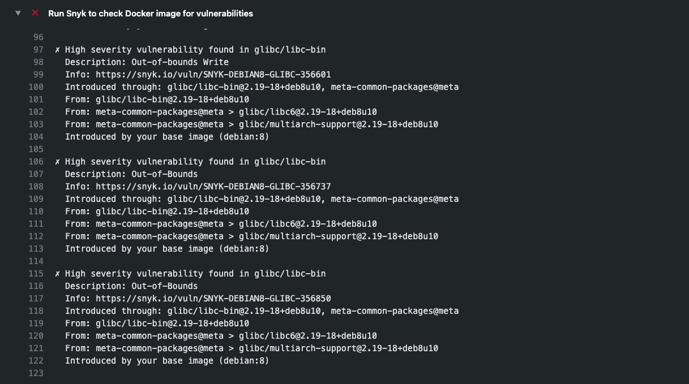

# Snykus

A real-world workflow for using Docker, Snyk and GitHub to build, secure and publish container images.

> 1. Build images on push, pull request and on a recurring schedule
> 2. Cache the layers between runs for faster builds
> 3. Push images to GitHub Container Registry depending on the nature of the ref
> 4. Monitor the different tags for vulnerabilities with Snyk
> 5. Fail a pull request check if the PR introduces a high-severity vulnerability

The workflow is reasonably complex, but it's also very powerful.

## Monitoring in Snyk

The workflow will build several different images, namely:

* Version tags, like `v0.1.0`
* `edge`, built from the default branch
* `nightly`, built once per day from the default branch

Each of these are pushed to GitHub Container Registry:

They are also monitored for vulnerabilities in Snyk:

By monitoring them in Snyk we can see the current vulnerabilities, but Snyk will also send alerts as new vulnerabilities are announced for images, even if they are not rebuilt for a period of time.

## Blocking a pull request with high-severity vulnerabilities

The workflow will fail the pull request check if the changes introduce high-severity vulnerabilities into the image. You can see an example of this in action in [#1](https://github.com/garethr/snykus/pull/1).

_Inspired by the example workflow from [docker/build-push-action](https://github.com/docker/build-push-action#complete-workflow)._
